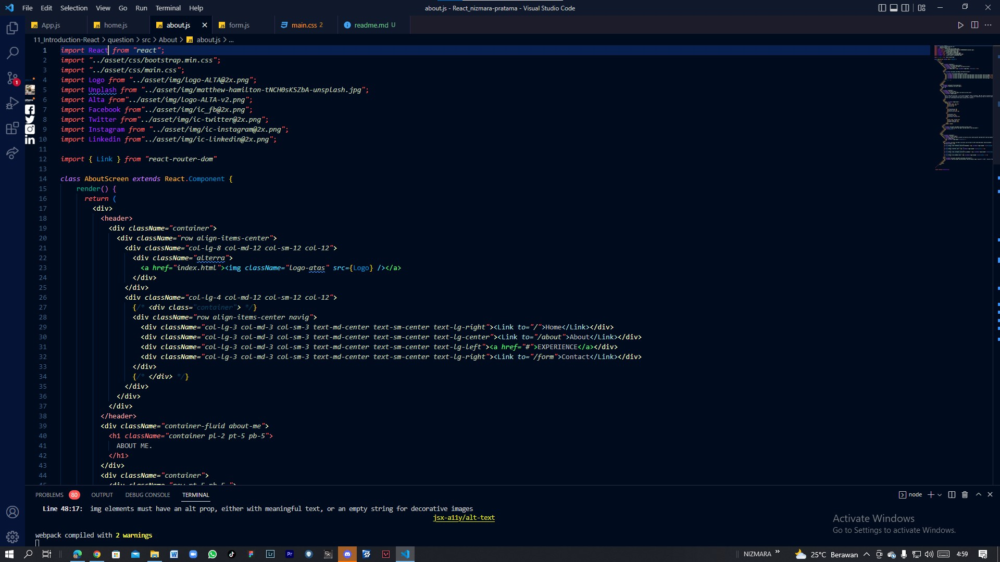

# SECTION 11_INTRODUCTION REACT

Pada materi ini terdapat 3 point yaitu :

1. React
2. Virtual DOM
3. Set up Development Environment

## APA ITU REACT ?

React adalah sebuah library JavaScript yang digunakan untuk membangun user interface yang interaktif. Library ini dibuat oleh Facebook dan bersifat open source. Library ini sangat populer digunakan dan selalu dikembangkan baik oleh kontributor utama ataupun komunitas. React berisi kumpulan snippet kode JavaScript (disebut ‘komponen’) yang bisa digunakan berulang kali untuk mendesain antarmuka pengguna.

## React terkenal karena konsep komponen. Di dalam React ada dua tipe komponen, yaitu:

- Functional component
  Functional component adalah komponen React yang dibangun murni menggunakan fungsi JavaScript. Functional component tidak menyimpan state dan digunakan hanya untuk menampilkan UI. Dengan kata lain, komponen ini dapat disebut dengan komponen stateless. Walaupun stateless, komponen ini dapat menerima data melalui properti atau dikenal dengan props.

- Class component
  Class component ialah komponen yang dibuat melalui Class JavaScript dan mewarisi sifat React Component. Berbeda dengan Functional Component, Class Component dapat menyimpan dan mengelola state serta memiliki beberapa metode salah satunya adalah render digunakan untuk menampilkan UI. Komponen ini dapat disebut dengan komponen stateful karena dapat memiliki state.

## Kelebihan ketika kamu memanfaatkan komponen React dalam membuat UI website:

- State Management: Ketika membuat stateful komponen, kamu bisa memanfaatkan state untuk memutuskan bagaimana UI di-render berdasarkan sebuah nilai/keadaan secara reactive.
- Encapsulated: Seluruh data (gambar, CSS, atau data terstruktur) yang dibutuhkan oleh komponen dalam menampilkan UI berada di dalam komponen tersebut. Itulah mengapa komponen React terenkapsulasi.
- Reusable: Selain terenkapsulasi, komponen React juga bersifat reusable atau dapat digunakan kembali. Kamu tidak perlu membuat banyak komponen untuk menampilkan UI yang sama. Cukup gunakan yang sudah kamu buat.
- Fast Development: Efek dari komponen yang reusable adalah pengembangannya jadi cepat. Berbeda bila kamu harus membuat segala sesuatu dari nol.

## Fitur-Fitur yang Ada di React

- JSX
  JSX merupakan ekstension dari sintaks JavaScript yang memungkinkan kamu untuk menuliskan sintaks bergaya XML guna memodifikasi DOM (Document Object Model).

- Data binding searah
  Data binding ini merupakan suatu proses menghubungkan elemen tampilan atau user interface dengan data atau komponen yang mengisinya.

## KENAPA MENGGUNAKAN REACT ?

- Deklaratif
  React membuatnya mudah untuk membuat UI interaktif. Rancang tampilan sederhana untuk setiap status dalam aplikasi Anda, dan React akan secara efisien memperbarui dan merender komponen yang tepat saat data Anda berubah.
  Tampilan deklaratif membuat kode Anda lebih dapat diprediksi dan lebih mudah untuk di-debug.

- Berbasis Komponen
  Bangun komponen yang dienkapsulasi yang mengelola statusnya sendiri, lalu menyusunnya untuk membuat UI yang kompleks.
  Karena logika komponen ditulis dalam JavaScript alih-alih template, Anda dapat dengan mudah meneruskan data kaya melalui aplikasi Anda dan menjauhkan status dari DOM.

- Belajar Sekali, Menulis Di Mana Saja
  Kami tidak membuat asumsi tentang sisa tumpukan teknologi Anda, sehingga Anda dapat mengembangkan fitur baru di React tanpa menulis ulang kode yang ada.
  React juga dapat merender di server menggunakan Node dan menjalankan aplikasi seluler menggunakan React Native.

## APA ITU VIRTUAL DOM ?

Manipulasi DOM adalah jantung dari web modern dan interaktif. Representasi dari UI berbentuk Javascript Object yang disimpan pada memori

## Masalah yang dihadapi dengan DOM manipulation

1. DOM manipulation secara manual dapat membuat code berantakan
2. Sulit untuk mengingat DOM state sebelumnya
3. Jauh lebih lambat daripada operasi javascript pada umumnya

## Set up Development Environment

Tools yang diperlukan

- Browser
  Google Chrome

- Text Editor / IDE
  Visual Studio Code

- Command Line Interface
  Untuk pengguna Linux/MacOs, dapat menggunakan terminal.
  Terminal ini sudah terpasang secara bawaan pada OS (tidak perlu install)

Untuk pengguna Windows, dapat menggunakan CMD / Powershell.
CMD ini juga sudah terpasang secara bawaan pada OS (tidak perlu install)

-----------------------------------------------------------------------------------------------------------------------------------------

# TASK OUTPUT INTRODUCTION REACT DAN PILGAN  Resource : halaman home bisa dilihat disini => https://drive.google.com/drive/folders/1Nw2lg57SE3sKkhD5QAO9rhvfsE6ELR_X?usp=sharing  Kalian dapat memanfaatkan halaman => https://magic.reactjs.net/htmltojsx.htm <= untuk dapat merubah halaman HTML ke JSX  

1. Buatlah sebuah project react baru. 
2. Buatlah sebuah file baru pada react, yang bernama home.js. Memasukkan halaman home.html ke dalam home.js. Sehingga, ketika kalian membuat react pada home tampilannya akan mirip dengan home.html. (Kalian juga perlu untuk memasukkan css dan assets yang kalian pakai)

