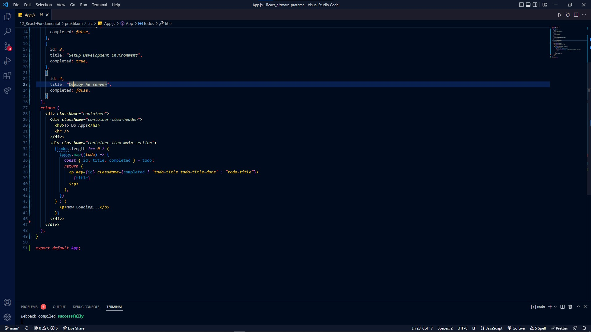
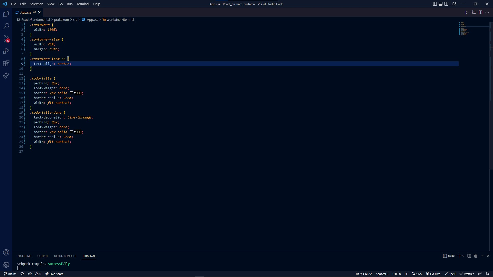
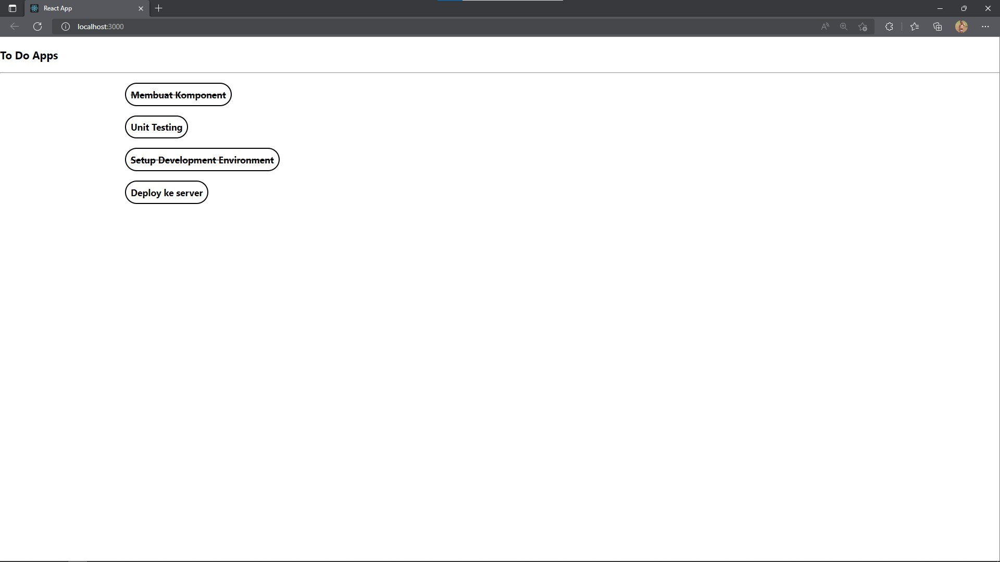

# 12_React Fundalmental

## APA ITU JSX ?
- singkatan dari JavaScript XML
- Ekstensi pada JavaScript

## KENAPA MENGGUNAKAN JSX ?
- JSX dibuatkan berdasarkan fakta kalau logika rendering sangat terikat dengan logic UI
- Separation of Technology -> Separation of Concerns

## JSX vs React.createElemet
- kita tidak harus menggunakan JSX, tapi JSX memudahkan kita menulis aplikasi React
- Syntactic Sugar dari fungsi: React.createElement(component,prop,...children)

## SPESIFIKASI JENIS EMELEM REACT
- Kapitalisasi untuk komponen React
- Huruf kecil (lowercase) untuk komponen bawaan

## MENARUH EXPRESSION PADA JSX
- kita dapat menaruh ekspresi JS yang valid pada JSX dengan menggunakan kurung kurawal.

## JSX ADALAH EXPRESSION
- setiap dikompilasi, Ekspresi JSX akan menjadi panggilan fungsi JavaScript dan menjadi objek JavaScript

## MENENTUKAN ATRIBUT DENGAN JSX
- Tanda kutip untuk menentukan string literal
- Kurung kurawal untuk menyematkan ekspresi JavaScript
- React DOM menggunakan camelCase sebagai konversi penamaan

## MENSPESIFIKASIKAN ELEMEN ANAK DENGAN JSX
- jika tag bersifat kosong (tidak memiliki elemen anak), kita bisa saja menutup secara langsung dengan />
- Tag JSX dimungkinkan untuk memilih elemen anak

--------------------------------------------------------------------------------------------------

## APA ITU COMPONENT ?

Komponent React adalah bagian kode yang dapat digunakan kembali yang digunakan untuk menentukan tampilan, behavior, dan state sebagai UI

## MEMBAGI UI MENJADI BEBERAPA COMPONENT
- filterableProductTable
- SearchBar
- ProductTable
- ProductCategoryRow
- ProductRow

--------------------------------------------------------------------------------------------------

# KOMPOSISI KOMPONEN & PROPS

## APA ITU PROPS ? 
- Singkatan dari properties, membuat kita dapat memberikan argumen / data pada component.
- Props membantu untuk membuat komponen menjadi lebih dinamis
- Props dioper ke component sama seperti memberikan atribut pada tag HTML
- Props pada m=component adalah read-only dan tidak dapat diubah

## KOMPOSISI KOMPONEN
- Kontaimen
- Spesialisasi

--------------------------------------------------------------------------------------------------

# REEACT LIFECYCLE

## LIFECYCLE METHOD YANG UMUM
1. render()
2. ComponentDidMount()
3. componentDidUpdate()
4. componentWillUnmount()

## 1. RENDER()
    - fungsi yang paling sering dipakai
    - required pada class component
    - pure function. Tidak boleh ada SetState()

## 2. COMPONENTDIDMOUNT()
    - dipanggil ketika component sudah di render untuk pertama kali
    - tempat yang tepat untuk pemanggilan API
    - boleh ada setState()

## 3. COMPONENTDIDUPDATE()
    - dipanggil ketika terjadi update (props atau state berubah)

## 4. COMPONENTWILLUNMOUNT()
    - dipanggil ketika component akan dihancurkan
    - cocok untuk clean up actions

# LIFECYCLE METHOD YANG LAINNYA
1. ShouldComponentUpdate()
2. Static getDerivedStateFromProps()
3. getSnapShotBeforeUpdate()

--------------------------------------------------------------------------------------------------

# RENDER BERSYARAT DAN LIST

## RENDER BERSYARAT 

Pada React kita dapat membuat komponen berbeda yang mencangkup perilaku yang di butuhkan. Lalu kita dapat me-render hanya beberapa bagian saja, berdasarkan dari Aplikasi.

- Menggunakan if
- inline if dengan operator &&
- inline if-else dengan ternary conditional operator
- mencegah komponen untuk rendering

## RENDER LIST

Kita dapat membangun koleksi dari beberapa elemen dan menyertakannya dalam JSX menggunakan tanda kurung kurawal{}.

## KEY

Key membuat React untuk mengidentifikasi item mana yang telah diubah, ditambahkan, atau dihilangkan.

--------------------------------------------------------------------------------------------------

# STRUKTUR DIREKTORI

React tidak memiliki pendapat tentang bagaimana cara memasukkan file ke folder

## HINDARI TERLALU BANYAK NESTING
## JANGAN TERLALU MEMIKIRKANNYA

--------------------------------------------------------------------------------------------------

## Membuat aplikasi daftar tugas (TODO list) yang memiliki 3 field yaitu :
- id (number)
- nama(string)
- completed(boolean)

1. Codingan App.js
   

2. Css pada TODO APP
   

3. Hasil Websitenya
   
