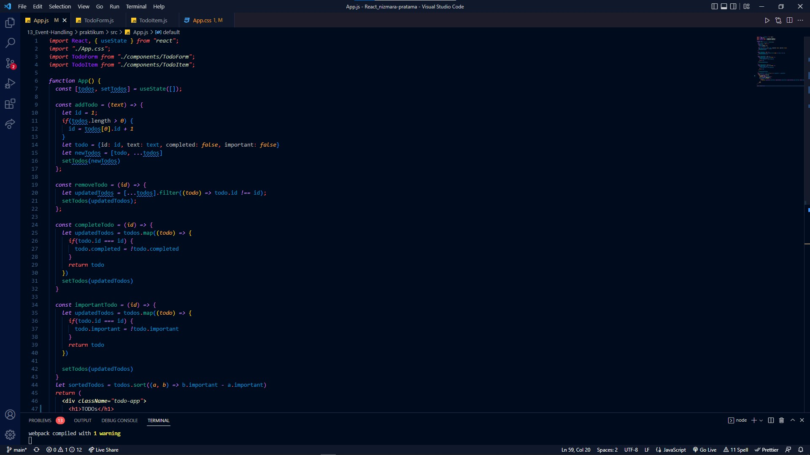
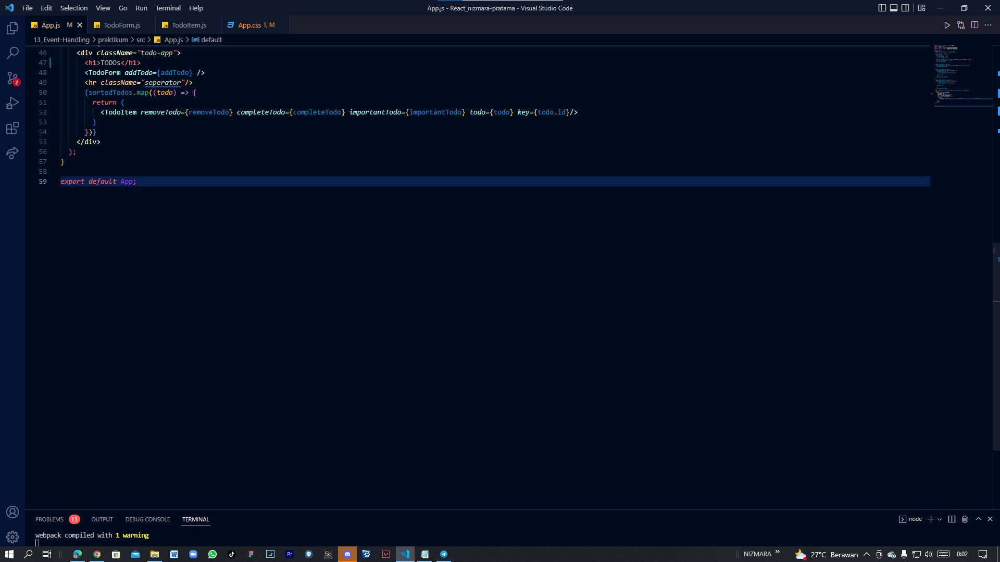
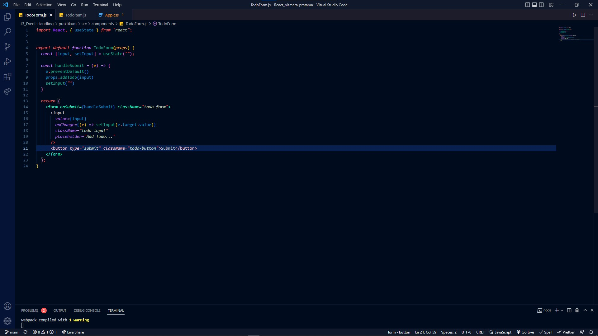
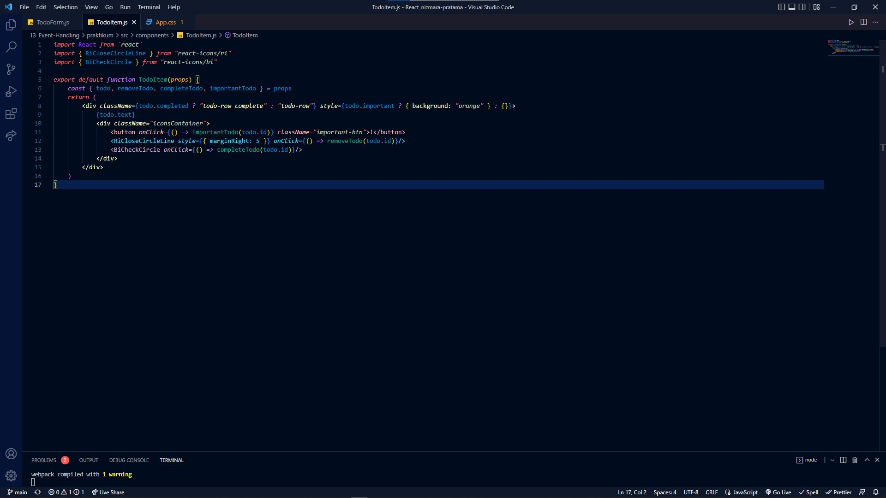
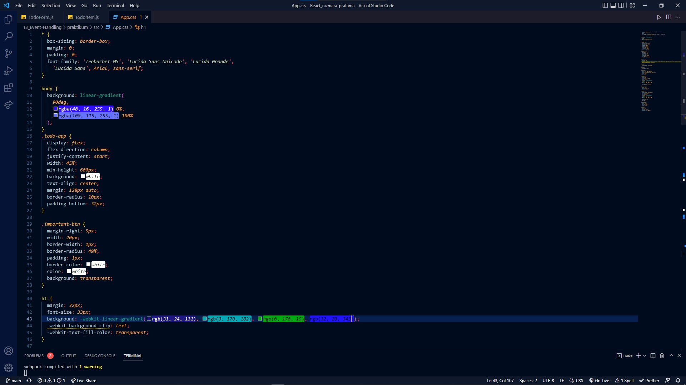
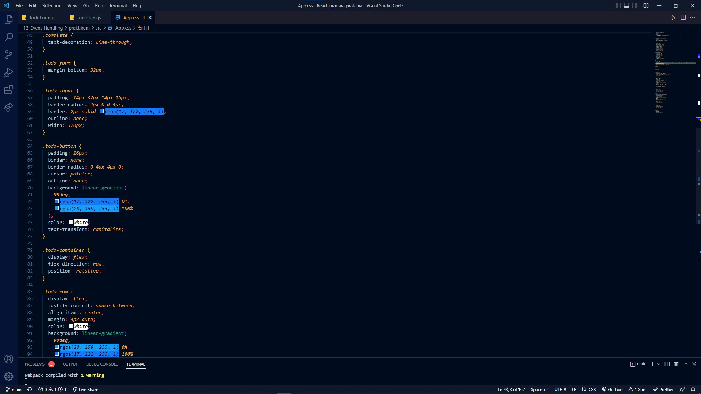
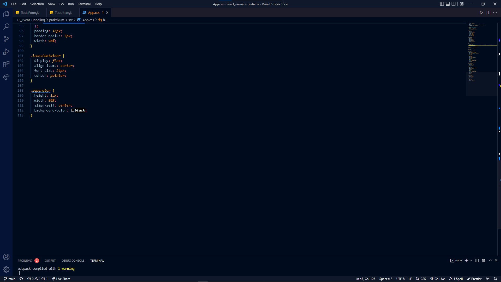
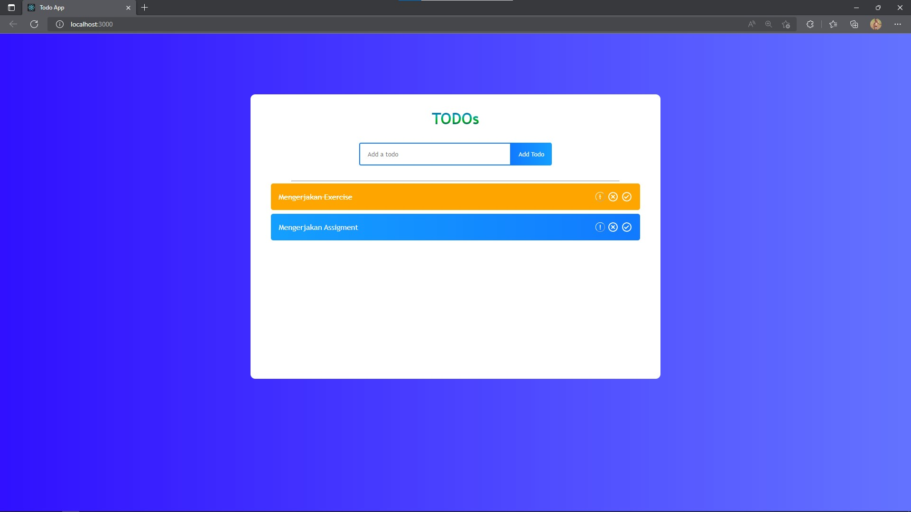

# 13_Event Handling

## APA ITU STATE ?

State adalah data private senuah component. Data ini hanya tersedia untuk component tersebut dan tidak bisa diakses dari component lain

## STATE
1. data yang bisa dimodifikasi menggunakan setState
2. setiap terjadi modifikasi akan terjadi render ulang
3. bersifat Asynchronous
4. dipakai dalam class

----------------------------------------------------------------------------------------------

# STATEFUL & STATELESS COMPONENT

## APA ITU STATEFUL COMPONENT ?
Stateful component adalah memiliki state. Component ini dibuat dengan class. Kelebihan dari class component adalah memiliki lifecycle

## APA ITU STATELESS COMPONENT ?
Stateless Component adalah tidak memiliki state hanya prop. Umumnya component ini dibuat dengan function karena codenya lebih ringkas

## KOMPONEN STATEFUL DAN STATELESS MEMILIKI BANYAK NAMA BERBEDA :
1. Smart component & Dump component
2. Container Component & Presentational component

## PERBEDAAN KOMPONEN DARI STATEFUL DAN STATELESS

    - Stateless component 
        1. tidak tahu tentang aplikasi
        2. tidak melakukan data fatching (pengembalian data)
        3. tujuan utamanya adalah visualiasi
        4. Dapat digunakan kembali 
        5. hanyak berkomunikasi dengan induk langsungnya

    - Stateful Component
        1. mengerti tentang aplikasi
        2. melakukan data facthing (pengembalian data)
        3. berinteraksi dengan aplikasi
        4. tidak dapat digunakan kembali
        5. meneruskan status dan data ke anak anaknya

## PENANGANAN EVENT DI REACT

## APA ITU HANDLING EVENT ?

handling event adalah sesuatu metode untuk menangani sebuah event/aksi yang diberikan pengguna kepada suatu komponen

event adalah suatu peristiwa yang dipicu oleh pengguna pada suatu komponen, misalnya tombol ditekan

## BEBERAPA CONTOH LIST EVENT
1. Clipboard Events (promise terpenuhi)
2. Form Events (onChange,onSubmit)
3. Mouse Events (onClick,onDoubleClick,onMouseOver)
4. Generic Events (onErorr, onLoad)

----------------------------------------------------------------------------------------------

## Assigment Event Handling

- Buatlah daftar pekerjaan yang akan kamu kerjakan, dengan kriteria sebagai berikut:
    1. Daftar pekerjaan dapat ditambahkan menggunakan inputan
    2. Terdapat checklist pada setiap daftar pekerjaan
    3. akttifitas checklist jika pekerjaan selesai dikerjakan, seperti contoh di bawah
    4. Sertakan tombol hapus untuk menghapus suatu pekerjaan dari daftar pekerjaan
    5. Apabila inputan yang anda submit tersebut kosong, tampilkan alert bahwa anda harus   mengisi inputan terlebih dahulu sebelum anda submit.

----------------------------------------------------------------------------------------------

1. ## App.js
   
   

2. ## TodoForm.js
   

3. ## TodoItem.js
   

4. ## App.css
   
   
   

5. ## Hasil TODOs
   
   