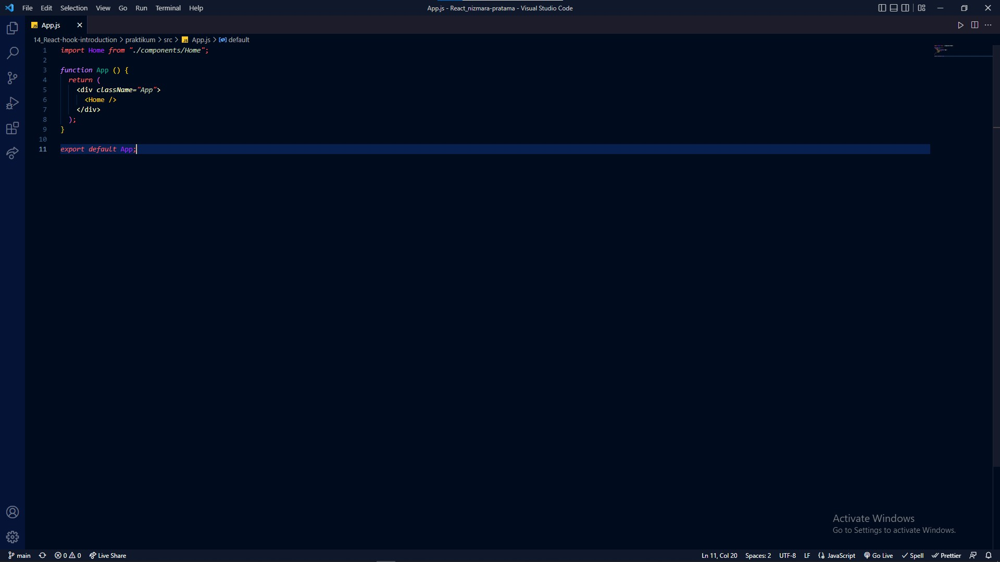

# 14_REACT HOOK INTRODUCTION

Apa itu Hook? Hook adalah fungsi spesial yang memungkinkan Anda “terhubung” dengan fitur-fitur di React. Sebagai contoh, useState adalah sebuah Hook yang memungkinkan Anda memberi state pada function components.

Hooks merupakan fitur baru di React 16.8. Dengan Hooks, kita dapat menggunakan state dan fitur React yang lain tanpa perlu menulis sebuah kelas.

## Motifasi

- Kesulitan untuk menggunakan kembali stateful logic antar komponen
- komponen kompleks menjadi sulit untuk dimengerti
- kelas membingungkan manusia dan mesin

## Hooks dasar

- useState
- useEffect
- useContext

## Hooks Tambahan

- useReducer
- useCallback
- useMemo
- useRef
- useImperativeHandle
- useLayoutEffect
- useDebugValue

## Aturan pada Hooks

- Hanya panggil Hooks di Tingkat atas
  jangan memanggil Hooks dari dalam loops, conditions, atau nested functions

- Hanya panggil Hooks dari fungsi-fungsi React
  Jangan memanggil dari fungsi-fungsi JavaScript biasa. Kita dapat :
    1. Memanggil Hooks dari komponen-komponen fungsi React.
    2. Memanggil Hooks dari custom Hooks

------------------------------------------------------------------------------------------------------------------------------------------------------------------------------------------------------------------------

# Implementasi useState & useEffect di Component

## Deklarasi Sebuah Variabel State

Di dalam kelas, kita menginisialisasi state count bernilai 0 dengan mengatur this.state menjadi { count: 0 } di dalam constructor. Di dalam sebuah function component, kita tidak memiliki this, jadi kita tidak bisa menulis atau membaca this.state. Sebagai gantinya, kita dapat memanggil Hook useState secara langsung di dalam komponen.

## Apa yang terjadi ketika memanggil useState ?

Ini mendeklarasi sebuah “variabel state”. Variabel kita bernama count tapi kita dapat menyebutnya sesuatu yang lain. Ini merupakan cara untuk “menjaga” nilai-nilai antar pemanggilan fungsi — useState adalah cara baru untuk menggunakan kapabilitas yang sama persis dengan this.state berikan di dalam sebuah kelas. Biasanya variabel-variabel “menghilang” ketika sebuah fungsi selesai tetapi variabel state “dipertahankan” oleh React.

## Apa yang kita berikan ke useState sebagai sebuah argumen ?

atu-satunya argumen Hook useState() adalah state awal. Tidak seperti kelas, state tidak harus berbentuk sebuah objek. Kita dapat menyimpan angka atau string jika hanya itu yang kita butuhkan.

## Apa yang dikembalikan useState ?

Ini mengembalikan sepasang nilai: state saat ini dan fungsi untuk melakukan pembaruan. Inilah kenapa kita menulis const [count, setCount] = useState(). Hal ini sama dengan this.state.count dan this.setState di dalam sebuah kelas, namun Anda mendapatinya sepasang

## use Effect()

- Effect Hook memungkinkan kita melakukan efek samping (side effects) dalam function component
- componentDidMount, componentDidUpdate dan componentWillUnmount = useEffect
- ada dua jenis : Butuh pembersihan dan tidak butuh pembersihan 

1. Effect tanpa pembersih
   
   kita ingin menjalankan beberapa kode tambahan setelah React memperbarui DOM. Permintaan jaringan, mutasi DOM manual, dan pencatatan adalah contoh umum dari effects yang tidak membutuhkan pembersihan. Kita mengatakan seperti itu karena kita dapat menjalankannya dan langsung melupakannya. Mari kita bandingkan bagaimana kelas dan Hooks memungkinkan kita mengekspresikan efek samping (side effects) seperti itu.

   - Apa yang di lakukan useEffect ?
    dengan menggunakan Hook ini, Anda mengatakan kepada React bahwa komponen Anda butuh menjalankan sestuatu setelah render. React akan mengingat fungsi yang Anda berikan (kita akan menyebutnya sebagai ”effect”), dan panggil itu nanti setelah DOM melakukan pembaruan

  - Kenapa useEffect dipanggil didalam komponen ?
    useEffect di dalam komponen memberikan kita akses kepada variabel state count (atau props apapun) langsung dari effect. Kita tidak membutuhkan API khusus untuk membacanya — itu sudah dalam lingkup function.

2. Effect dengan Pembersih 

    Sebelumnya, kita melihat bagaimana cara mengeskpresikan efek samping (side effects) yang tidak membutuhkan pembersihan. Namun, beberapa effects bisa melakukannya. Sebagai contoh, kita mungkin ingin mengatur subscription ke beberapa sumber data eksternal. dalam hal ini, penting untuk membersihkan agar tidak menyebabkan kebocoran memori! Mari kita bandingkan bagaimana kita melakukannya dengan classes dan dengan Hooks.

    - Kenapa kita mengembalikan sebuah fungsi dari effect kita ?
    Ini adalah sebuah mekanisme pembersihan untuk effects. Setiap effect dapat mengembalikan sebuah function setelah pembersihan. Ini memungkinkan kami tetap menjaga logika untuk menambah dan menghapus sebuah subscriptions yang dekat satu sama lain

    - Kapan tepatnya React membersihkan sebuah effect ?
     effects berjalan untuk setiap render dan tidak hanya sekali. Inilah kenapa React juga membersihkan effects dari render sebelumnya, sebelum menjalankan effects di waktu yang berikutnya.

------------------------------------------------------------------------------------------------------------------------------------------------------------------------------------------------------------------------

## Membuat Custom Hooks

Membuat Hook kita sendiri memungkinkan kita mengekstrak komponen logika ke fungsi yang dapat digunakan lagi.

------------------------------------------------------------------------------------------------------------------------------------------------------------------------------------------------------------------------

## Ubah Class Component pada assigment sebelumnya menjadi function component. Sekaligus ubah lifesysle method & state management menggunakan React Hooks.

1. App.js
   

   

2. App.css
   

   

   

3. TodoForm.js
   

4. TodoItem.js
   

5. Hasil Todo App
   
   