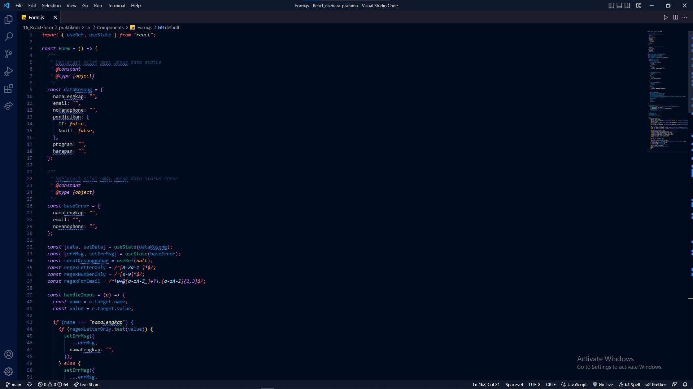
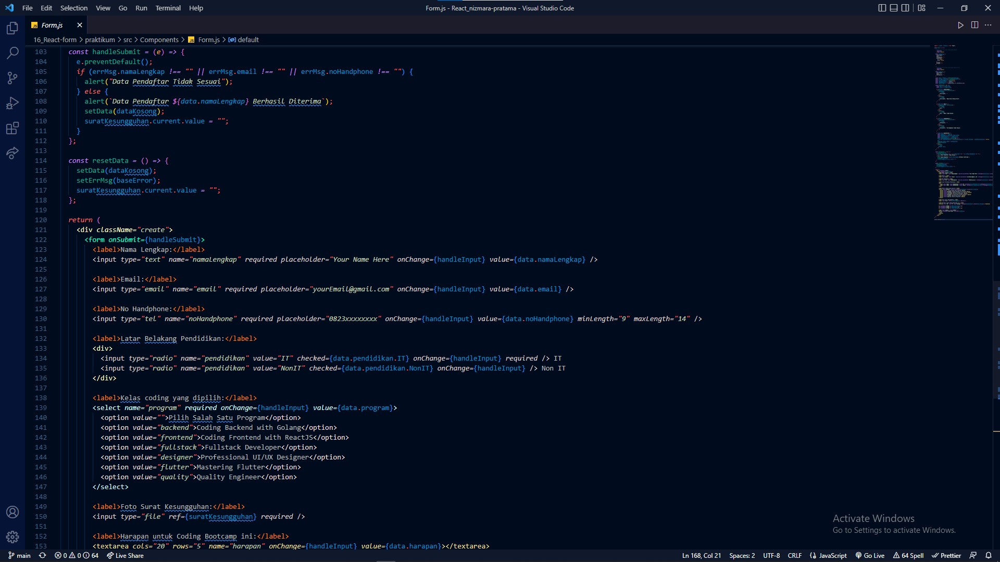
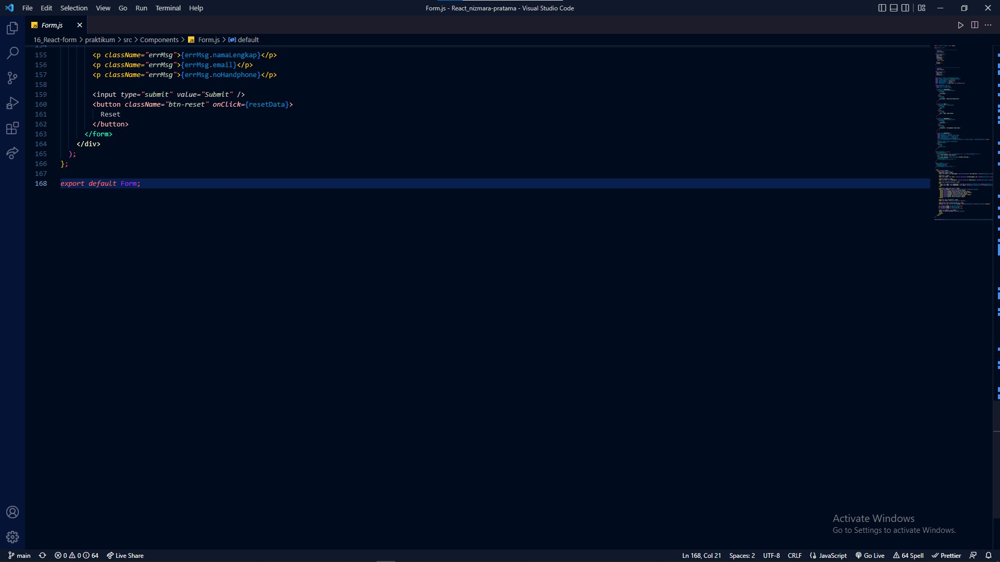
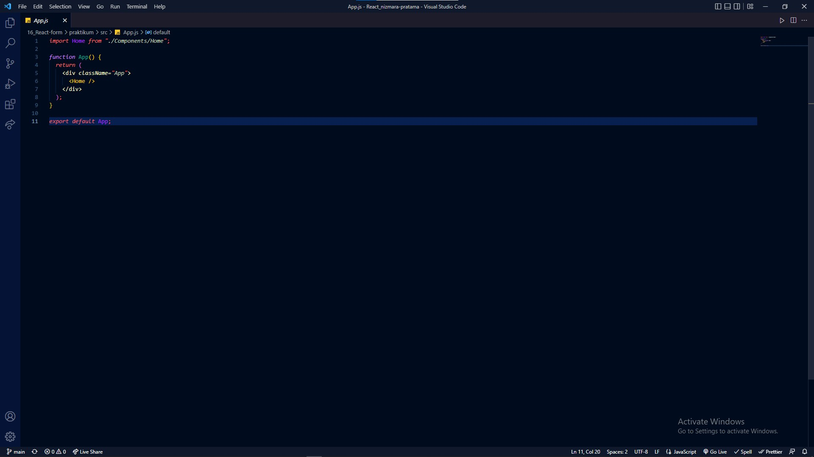
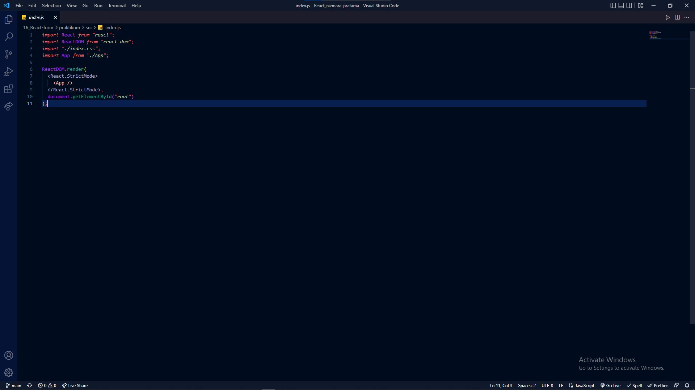
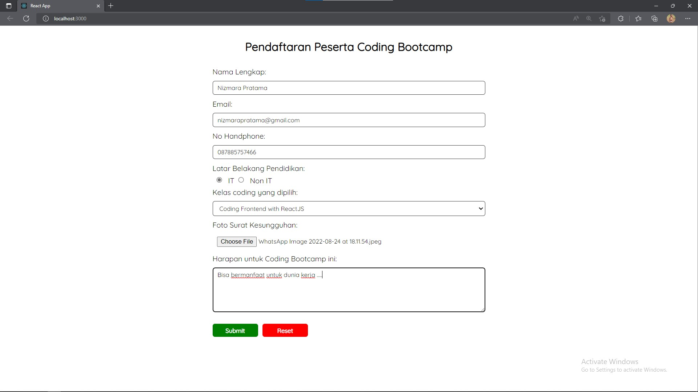
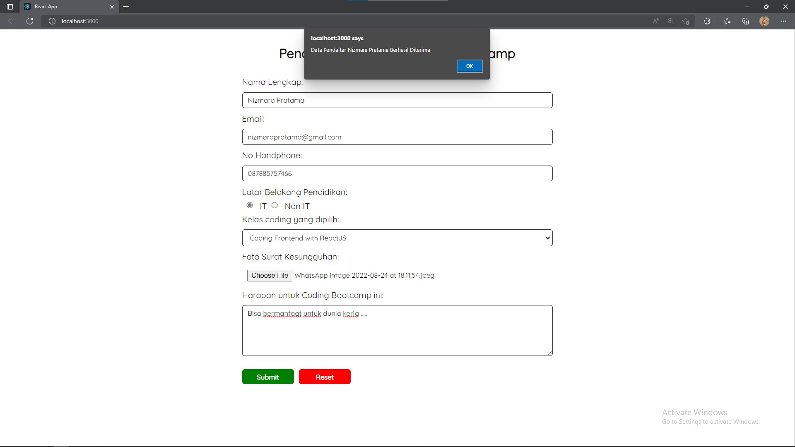

## Membuat Formulir berjudul "Pendaftaran Peserta Coding Bootcamp".

## 1. Form.js
   

   

   

   

## 2. Home.js
   

## 3. App.css
   

## 4. App.js
   

## 5. index.css
   

   

## 6. index.js
    

## 1. Hasil data yang Sesuai
   

   

## 2. Hasil data yang tidak Sesuai
   

   
