# BASIC FORM

## Penggunaan Form

### Penerapan Form
Form merupakan salah satu hal krusial dalam pengembangan aplikasi website. Form dapat digunakan untuk menghandle inputan dari user.

Form banyak kita jumpai saat login, mendaftarkan sesuatu memberikan feedback, mengisi data dan masih banyak lagi.

Dalam react akan ada banyak hal yang harus kita pelajari dari Form. Seperti menghandle inputan, memvalidasi inputan dsb.

## Macam Form

1. Elemen <input>
   
   Element<input> biasanya digunakan inputan yang tidak terlalu panjang.

2. Elemen <textarea>
   
   Element <textarea> biasanya digunakan inputan yang cukup panjang, Semisal deskripsi.

3. Elemen <select>
   
   Element<select> biasanya digunakan untuk inputan yang pilihannya sedah ditentukan.

4. Radio Button
   
   Radiobutton merupakan salah satu type di elemen<input>. Kita hanya bisa memilih 1 pilihan menggunakan radiobutton.

5. Checkbox
   
   Checkbox merupakan salah satu type di elemen<input>. Kita bisa memilih lebih dari 1 pilihan menggunakan checkbox.

## Type elemen input lainnya.

- text(default)
- button
- color
- checkbox
- date
- datetime-local
- email
- file
- hidden
- image
- month
- number
- password
- radio
- range
- reset
- search
- submit
- tel
- time
- url
- week

-----------------------------------------------------------------------------------------------------------------------------------------------------------------------------------------------

# CONTROLLED COMPONENT

- Apa itu controlled Component
- Tag Textarea
- Tag Select
- Handle Banyak Input

## Apa itu Controlled Component ?

Dapat menggabungkan cara menyimpan dan memperbaruai state di HTML dan React dengan menggunakan state pada React. Kemudian Komponen React yang me-render sebuah form juga mengontrol apa yang terjadi dalam form tersebut pada masukan pengguna selanjutnya.

Sebuah elemen masukan form yang nilainya dikontrol oleh React melalui cara seperti "Controlled component".

Pada HTML, elemen form seperti <input>, <textarea> dan <select> biasanya menyimpan state mereka sendiri dengan memperbaruinya berdasarkan masukan dari pengguna. Di React, state yang dapatberubah seperti ini biasanya disimpan pada properti dari komponen dan hanya akan diubah menggunakan setState().

## TAG TEXTAREA

Textarea pada HTML

Pada HTML, elemen <textarea> mendefinisikan di dalamnya sebagai elemen anaknya. Di React, <textarea> menggunakan atribut value. Dengan cara, sebuah form yang menggunakan <textarea> dapat dituliskan dengan cara yang sangat mirip dengan sebuah form yang menggunakan input satu baris.

## Tag Select

HTML vs React

Pada HTML, <select> membuat sebuah daftar drop-down. Di React, alih-alih menggunakan atribut selected, kita menggunakan atribut value di tag select. Hal ini lebih mudah karena hanya perlu diubah si satu tempat saja. Secara kesuluruhan, perubahan-perubahan dapat membuat <input type="text">, <textarea> dan <select> bekerja dengan cara yang mirip-mirip dan masing-masing menerima atribut value yang dapat digunakan untuk mengimplementasikan controlled component. 

## kita bisa memasukan array ke atribut value, yang memungkinkan kita memilih beberapa opsi dalam tag select
<select multiple={true} value={['B', 'c']}>

-----------------------------------------------------------------------------------------------------------------------------------------------------------------------------------------------

## Handle Banyak input 

Ketika membutuhkan penanganan banyak elemen yang pada controlled component, kita dapat menambahkan atribut nama pada elemen dan membiarkan fungsi handler memilih apa yang harus dilakukan berdasrkan niali dari event.target.name.

-----------------------------------------------------------------------------------------------------------------------------------------------------------------------------------------------

# UNCONTROLLED COMPONENT

- Apa itu Uncontrolled Component
- Niali default
- Tag File Input

## Apa itu Uncontrolled Component ?

Uncontrolled Component adalah alternatif lain dari contrilled component, dimana data form akan ditangani oleh DOM-nya sendiri. Untuk menulis uncontrolled component, alih" menulis event handler untuk setiappembaruan state, kita bisa menggunakan ref untuk mendapatkan niali form dari DOM.

Karena hal ini, terkadang lebih mudah untuk mengintegrasikan kode React dan non-React jika menggunakan uncontrolled component. ini berarti lebih sedikit kode jika kita menginginkan solusi cepat walau tak rapih. Selain itu pada umumnya kita harus menggunakan controlled component.

## Nilai Default

Atribut default Value

Pada lifecycle rendering react, atribut value pada elemen form akan menimpa nilai pada DOM. Dengan uncontrolled component, sering kali kita ingin React dapat menentukan niali awal tetapi pembaruan berikutnya dilakukan secra uncontrolled. Untuk menangani kasus ini. kita bisa menggunakan atribut defaultValue alih" menggunakan value. 

Kita bisa menggunakan defaultChecked untuk <input type="checkbox"> dan <input type="radio">, serta defaultValue untuk <select> dan <textarea>.

## Tag File Input

Pada HTML, sebuah <input type="file"> memungkinkan pengguna untuk memilih satu atau beberapa file dari media penyimpanan mereka untuk diunggah ke server atau dimanipulasi dengan JavaScript lewat File API.

Dalam React, sebuah <input type="file" /> merupakan uncontrolled component karena nialinya harus bisa disetel oleh pengguna, bukan oleh kode program.

-----------------------------------------------------------------------------------------------------------------------------------------------------------------------------------------------

# UNCONTROLLED VS CONTROLLED COMPONENT

## Uncontrolled Component ?

input yang tidak terkontrol seperti input formulir HTML tradisional. Kita kemudian bisa mendapatkan nialinya menggunakan ref. misalnya, di tombol ditambahkan onClickhandler.

## Uncontrolled Component ?

dengan kata lain, harus 'menarik' nilai dari field saat kita membutuhkannya. Ini bisa terjadi ketika formulir di submit.

itu adalah cara paling sederhana untuk mengimplementasikan input formulir. Tentu saja ada Kasus yang valid untuk menggunakannya: dalam form sederhana dan saat belajar React.

Namun, uncontrolled input tidak powerful. Jadi selanjutnya kita akan mempelajari controlled input.

## Controlled Component

Sebuah controlled input menerima niali saat ini sebagai prop, serta callback untuk mengubah niali tersebut. Kita bisa mengatakan ini adalah cara yang lebih "React way" untuk pendekatan ini (yang tidak berarti harus selalu menggunakannya). Tetapi niali input harus ada state yang disimpan disuatu temat. Biasanya, komponen yang merender input (alias form component) menyimpannya di state-nya. itu bisa dalam state komponen lain, atau bahkan di penyimpangan state terpisah (seperti state store), seperti Redux.

## Flow Controlled Component

Setiap kali kita mengetik karakter baru, handleNameChange dipanggil. Dibutuhkan nilai baru dari input dan mengaturnya di state.

Contoh saat kita mengetik a dan handleNamechange mendapat a dan panggilan setState. Input tersebut kemudia dirender ulang untuk memiliki nilai a.
Jika mengetik ab. handleNameChange mendapatkan nilai dari ab dan menetapkannya ke state. Input dirender ulang sekali lagi, sekarang dengan value="ab".

## Controlled Component ?

ini juga bahwa, komponen form dapat merespont perunahan input dengan segera misal :
- umpan balik di tempat, seperti validasi
- menonaktifkan tombol kecuali semua field memiliki data yang valid
- mengimplementasi format input tertentu, seperti nomor kartu kredit

Flow semacam mendorong perubahan niali ke form component, sehingga Form komponen selalu memiliki niali input saat ini, tanpa perlu memintanya secara eksplisit. Ini berarti data (state) dan UI (input) selalu sinkron. State memberikan niali ke input, dan input meminta Form untuk mengubah niali saat ini.

## Apa yang membuat Elemen 'Controlled' ?

Selain input ada elemen bentuk lain, seperti checkboxes radios, selects and textareas. Elemen formulir terjadi "controlled" jika menetapkan nilainya melalui prop. Akan tetapi masing-masing elemen formulir memiliki prop yang berbeda untuk menetapkan nilai itu.

   Element                          Value Property              Change Callback     New Value in callback

   - <input type="text" />          value="string"              onChange            event.target.value
   - <input type="checkbox"/>       checked={boolean}           onChange            event.target.checked
   - <input type="radio"/>          checked={boolean}           onChange            event.target.checked
   - <textarea />                   value="string"              onChange            event.target.value
   - <select />                     value="opstion value"       onChange            event.target.value

## Kesimpulan

Form controlled dan uncontrolled memiliki kelebihannya sendiri. Kita perlu mengevaluasi situasi kita secara spesifik dan memilih pendekatan apa yang cocok untuk kondisi kita. Jika formulir sangat sedrhanan dalam hal umpan nalik UI. uncontrolled dengan refs sepenuhnya sebaik-baiknya. Kita tidak perlu mendengarkan apa yang dikatakan sebagai artikel bahwa uncontrolled itu "buruk". Lagipula kita selalu dapat berimigarasi ke controlled input.

-----------------------------------------------------------------------------------------------------------------------------------------------------------------------------------------------

# BASIC VALIDATION

## Kenapa perlu validasi ?

Pada dasarnya ada 3 alasan mengapa validasi form diperlukan :
- mecari input data yang benar dan sesuai format.
- melindungi akun pengguna.
- melindungi sistem/aplikasi.

## Tipe Validasi Data Formulir

Client-side validation yang dilakukan pada sisi klien(browser). Validais ini dilakukan agar data input sesuai dengan kebutuhan form. sebelum data firm dikirkan ke server.

Kelebihan validasi sisi klien ialah user-friendly, karena jika terjadi kesalahan pengguna akan langsung diberitahu.

## Client-side Validation

- built-in form validation, yaitu menggunakan fitur validasi langsung dari HTML5. biasanya validasi ini tidak membtuhkan javascript dan memiliki performa yang lebih baik. kadang-kadang pesan errornya cukup kaku. Contohnya: required, minlength, maxlength, min, max, type dan patten
- menggunakan JavaScript. membuat validasi form dapat dikostumiasisi. Tetapi harus membuat sendiri.

## Sever-side validation

Sisi server bertugas untuk memvalidasi data kembali, sebelum disimpan di database. jika ditemukan kesalahan, maka response akan dikirim kembali ke clint berupa koreksi atas kesalahan yang dibuat oleh pengguna. Validasi ini tidak user-friendly karena koreksi kesalahan akan dikirimkan, setelah form-disubmit.

## Built-in form validation

- required digunakan untuk menentukan field form perlu diisi sebelum formulir dapat dikirimkan.
- minlength dan maxlength digunakan untuk menentukan jumlah karakter minimal dan maksimal yang bisa dimasukkan.
- min dan max digunakan untuk menentukan niali minimum dan maksimum angka yang bisa dimasukkan.type digunakan untuk menentukan apakah data berupa angka, email, atau type yang lainnya.
- pattern digunakan untuk menentukan regular expression(regex) yang memfalidasikan pola data yang boleh dimasukkan.

## Menggunakan JavaScript

Bisa kapan saja menggunakan JavaScript ?
- ketika ada perubahan di form. Ketika ada perubahan akan mentrigger event onChange.
- ketika menekan tombol submit. ketika menekan tombol submit, akan mentrigger onSubmite. validasi cukup sekali, namun tidak akan real-time memvalidasi form.

-----------------------------------------------------------------------------------------------------------------------------------------------------------------------------------------------

## Membuat Formulir berjudul "Pendaftaran Peserta Coding Bootcamp".

1. Form.js
   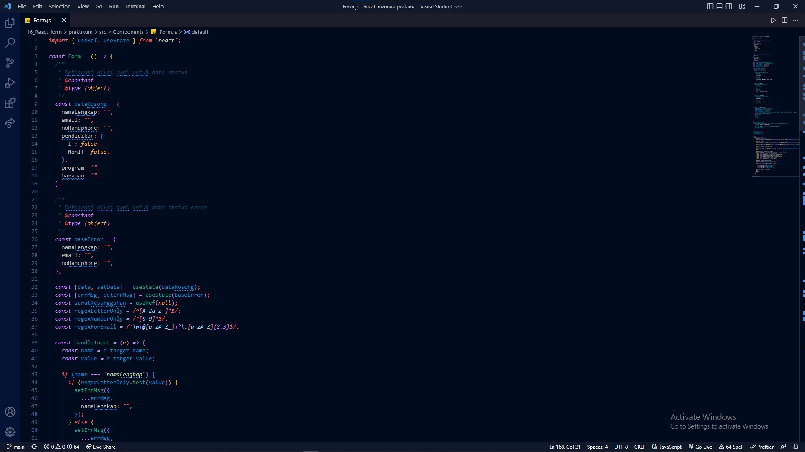

   

   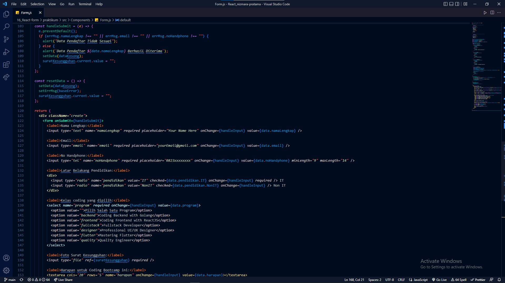

   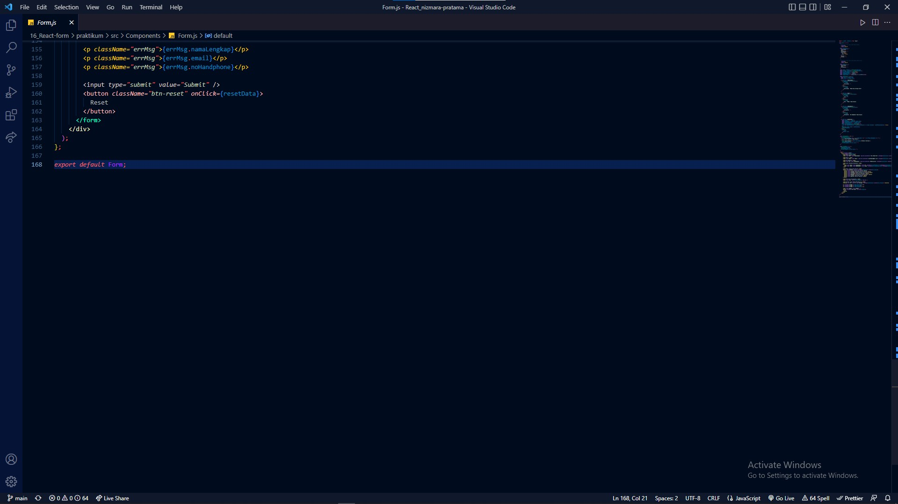

2. Home.js
   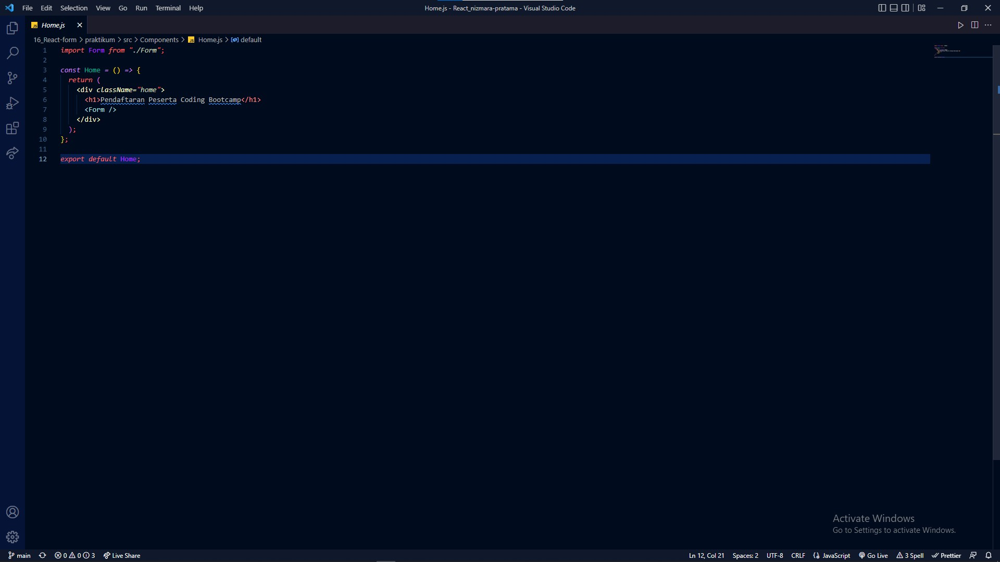

3. App.css
   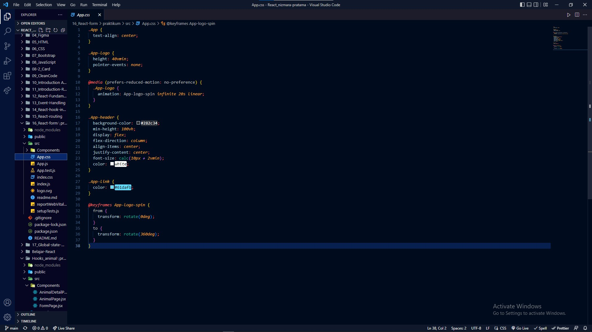

4. App.js
   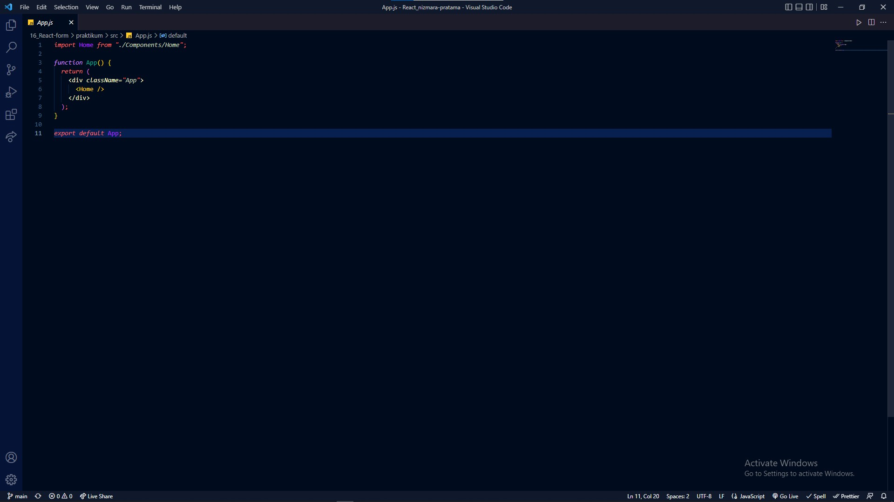

5. index.css
   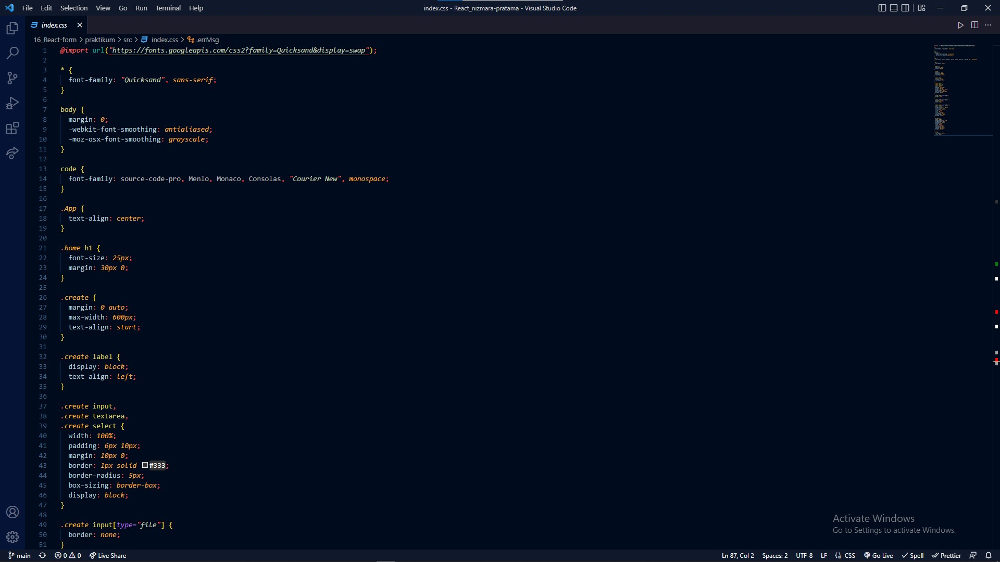
   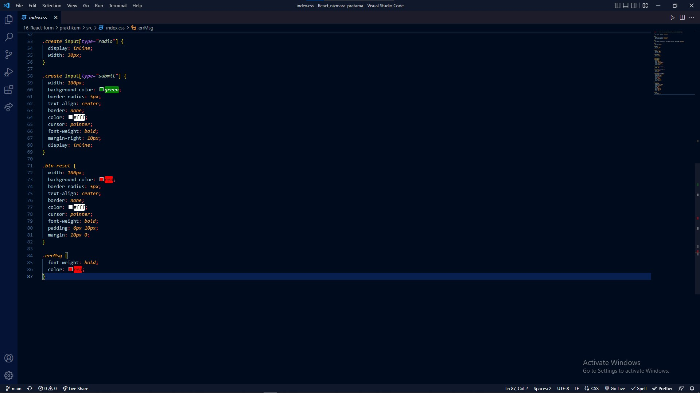

6. index.js
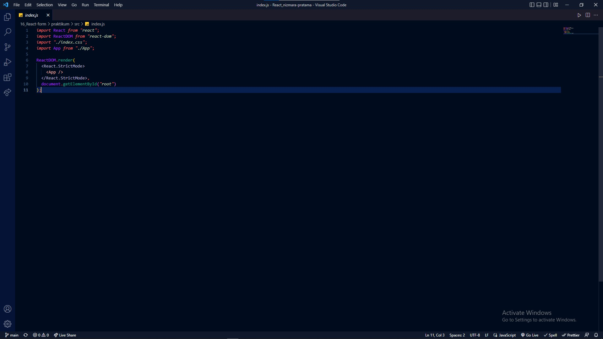

7. Hasil data yang Sesuai
   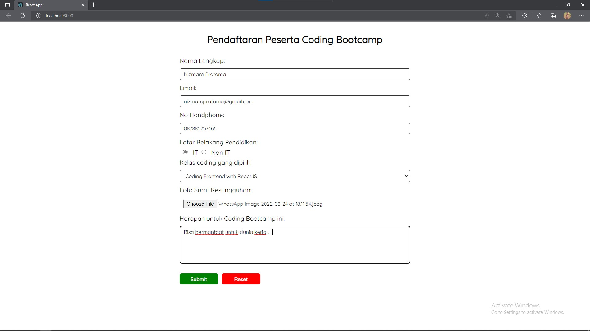
   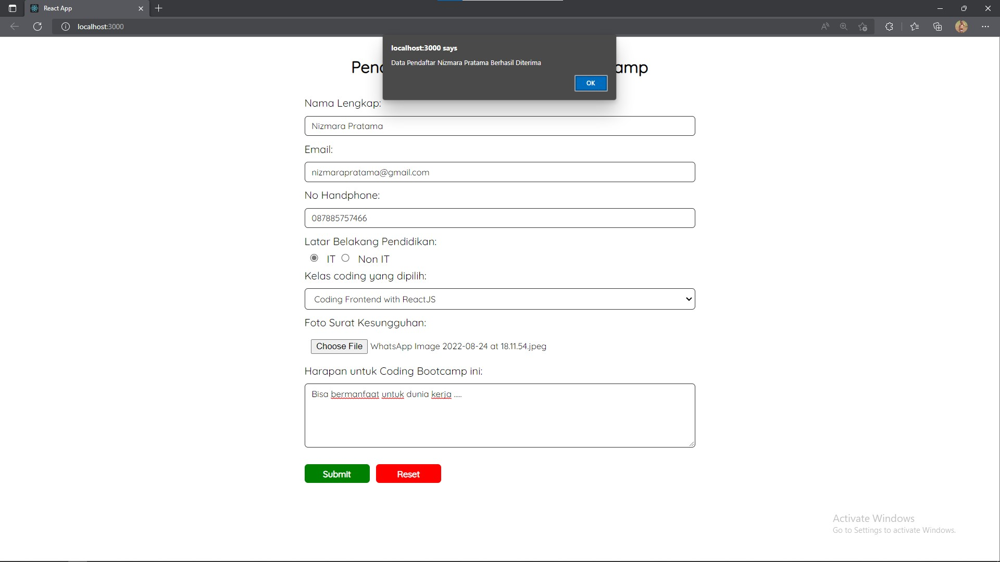

8. Hasil data yang tidak Sesuai
   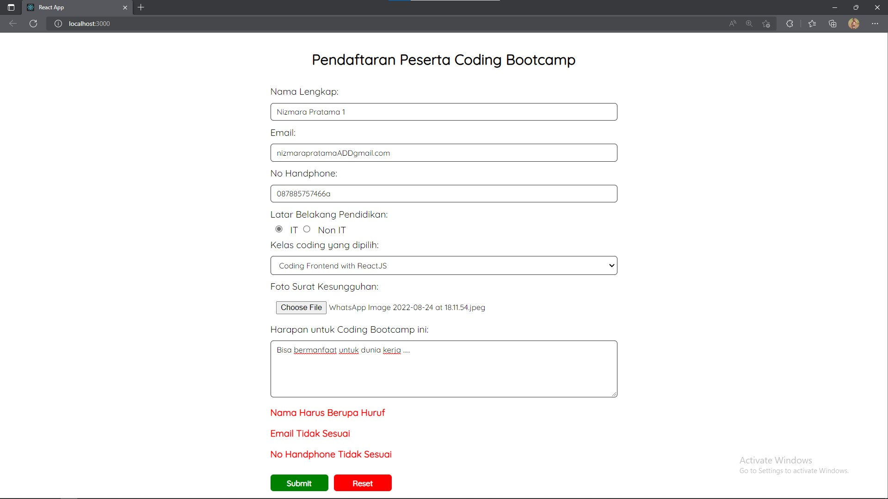
   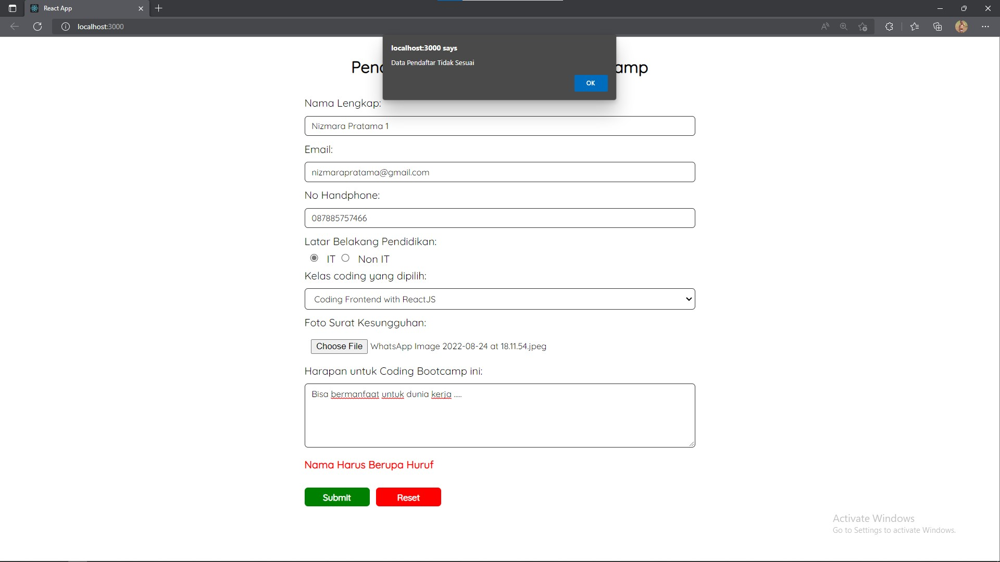
