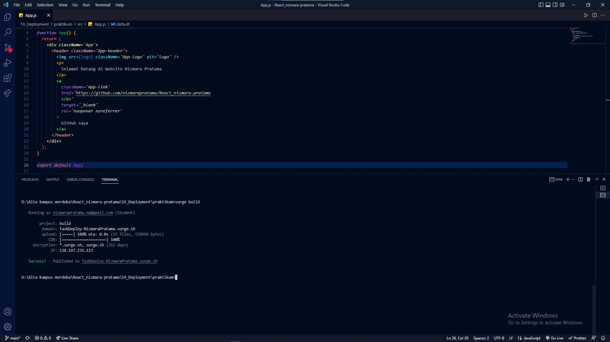
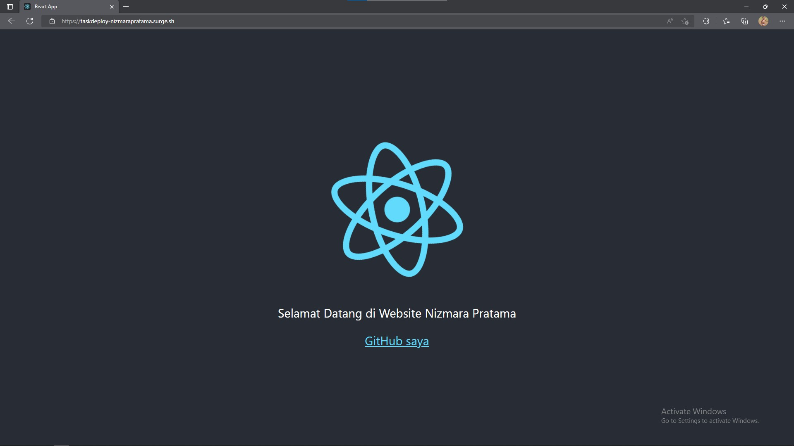

# 19_Deployment Build React App

## Kenapa perlu Build ?

secara default, React mengandung bayak pesan peringatan. Peringantan-peringatan ini sangat berguna dalam pengembangan aplikasi. Namun, pesan-pesan ini membuat React menjadi lebih besar dan lambat. Oleh karenanya kita harus menggunakan versi produksi ketika men-deploy aplikasi. 

Tujuan melakukan build agar aplikasi kita menjadi versi production, sehingga performanya lebih ringan dan cepat.

## Build React App

Karena proyek kita dibangun menggunakan Create React App.

*npm run build*

Ini karena membuat versi produksi untuk aplikasi kita di dalam folder _build_. Ini hanya diperlakukan sebelum men-deploy ke produksi. Untuk pengembangan normal, gunakan *npm start*.

## Run Optimized App

Untuk menjalankan aplikasi yang optimal di lokal komputer kita, kita bisa menggunakan _serve_.

- install serve npm intall -g serve
- jalankan servel di lokal serve -s build

# Deployment

## Apa itu Deployment ?

Deployment adalah kegiatan yang bertujuan untuk menyebarkan aplikasi yang sudah kita buat. Harapannya apliaksi tersebut dapat diakses oleh banyak orang, tidak hanya oleh kita sendiri.

## Deployment dengan surge

### Apa itu surge ?

Surge adalah layanan penerbit website statik (static web publishing) gratis untuk Front-End Developers. Website statik yang menggunakan surge akan memiliki subdomain. *.surge.sh.Surge dapat menerima File HTML, CSS dan JS.

## Install Surge

1. Pastikan menggunakan versi Node yang terbaru.
2. install Surge

_npm install --global surge_

## Deploy dengan Surge

Jalankan peruntah `surge` di terminal.

`Alta kampus merdeka\React_nizmara-pratama\19_Deployment\$ surge`

## Teardown Surge

Terkadang kita tidak ingin mempublikasikan sebagian domain atau subdomain. Untuk itu kita bisa teardown sebuah project melalui surge CLI. ini efektif membuat proyek kita offline.

`surge teardown vancouver.surge.sh`

`Alta kampus merdeka\React_nizmara-pratama\19_Deployment\$ surge teardown imene-person.surge.sh`

# Doployment dengan Netlify CLI

## Apa itu Netlify ?

Netlify adalah salah satu platform penyedia layanan build tools sekaligus Continous Deployment. Netlify memungkinkan kita mempublish website statis secara gratis. Netlify juga sudah terintegrasi dengan Git Host popular seperti Github, Gitlab dan Bitbucket.

## Deploy dengan Netlfy

1. Membuat akun Netlify
2. Install Netlify CLI di terminal 
    `npm install netlify-cli-g`
3. jalankan perintah netlify deploy di terminal.
    `Alta kampus merdeka\React_nizmara-pratama\19_Deployment\$ netlify deploy`
4. Verrify akun melalui browser, pilih Authorize
5. Pilih "Creat $ configure a new site".
6. Pilih lokasi file yang akan di deploy. Pilih ./build.

--------------------------------------------------------------------------------------------------------------------------------------------------------------------------------------------------

# Assigment ReactJS Topic deployment

Deploylah code create react project yang sedikit diubah. Deploy menggunakan _Surge/Netlify_. Link deploy memiliki format "taskDeploy-namaKalian", Kemudian dikumpulkan.

## [TaskDeploy-NizmaraPratama.surge.sh](TaskDeploy-NizmaraPratama.surge.sh)

## Gambar Deployment

1. Success Deployment
   

2. Hasil Deployment
   